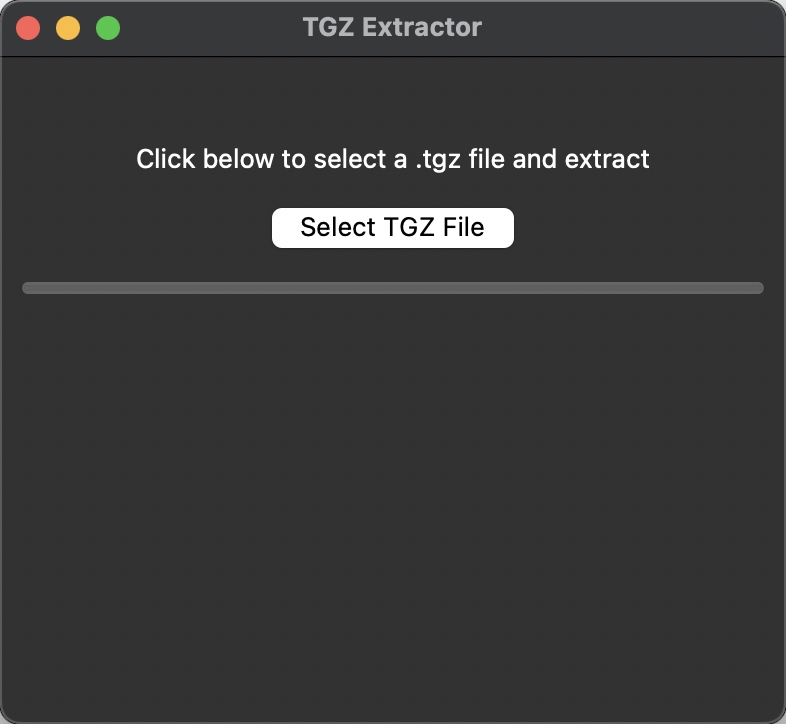
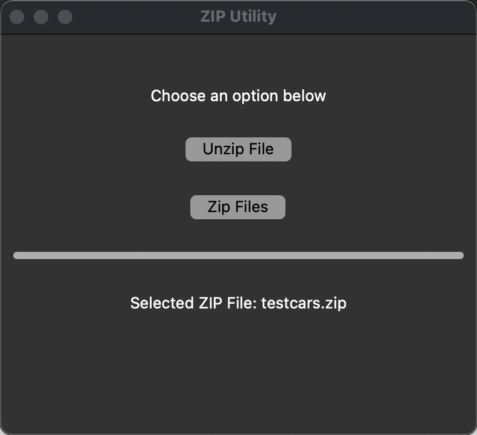

# TGZ Extractor & Zip and Unzip 

This is a simple Python GUI tool built using **Tkinter** to extract `.tgz` files.

## Prerequisites
Ensure you have the following installed on your system:
- Python (>=3.7)
- pip (Python package manager)

## Installation
Follow these steps to install the required dependencies:

1. **Clone or Download the Script**
   ```sh
   git clone <repository_url>
   cd <repository_folder>
   ```
   *Alternatively, download `tgz.py` manually.*

2. **Create a Virtual Environment (Recommended)**
   ```sh
   python -m venv venv
   source venv/bin/activate  # On macOS/Linux
   venv\Scripts\activate     # On Windows
   ```

3. **Install Required Dependencies**
   ```sh
   pip install tk
   ```
   *(Tkinter is usually included with Python, but install it manually if needed.)*

## Running the Script
Run the script with:
```sh
python tgz.py
```

## How to Use
1. Click the **"Select TGZ File"** button.
2. Choose a `.tgz` file from your computer.
3. Select a directory where the extracted files should be placed.
4. The extraction progress will be displayed in the progress bar.
5. Once completed, a success message will appear.




## ZIP Utility
This is a Python GUI tool for zipping and unzipping `.zip` files using **Tkinter**.

### Running the ZIP Utility
Run the script with:
```sh
python zip.py
```

### How to Use
1. Click the **"Unzip File"** button to select and extract a `.zip` file.
2. Click the **"Zip Files"** button to select multiple files and compress them into a `.zip` archive.
3. The selected file(s) will be displayed on the screen.
4. A progress bar will show the status of the operation.
5. Once completed, a success message will appear.



## Troubleshooting
- If Tkinter is missing, install it manually:
  ```sh
  sudo apt-get install python3-tk  # For Ubuntu/Linux
  brew install python-tk           # For macOS
  ```

- If running on Windows and `tkinter` is not found, try reinstalling Python and ensure "tcl/tk" is included in the installation.

